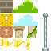

# game-mario-wannabe

This is the implementation following the steps of the
[Tracks Games - Mario](https://cs50.harvard.edu/x/2020/tracks/games/) activity

Each video is managed with in a new feature branch that is merged on the develop branch after done.

## Mario 0

+ Load the spritesheet.png image .
+ Create and present the tiles from the map on the screen,

## Mario 1

+ Scroll the screen to the left

## Mario 2

+ Move map using w,a,s,d keys
+ Add map borders

## Mario 3

+ Create radom elements on the map

## Mario 4

+ Add the alien avatar
+ Add the player class to control the avatar

# Mario 5

+ Move the avatar to left and right
+ Move the map when necessary

# Mario 6

+ Animate the avatar movement
+ Walk to the left and to the right

# Mario 7

+ Add Jump behavior
+ Add gravity

